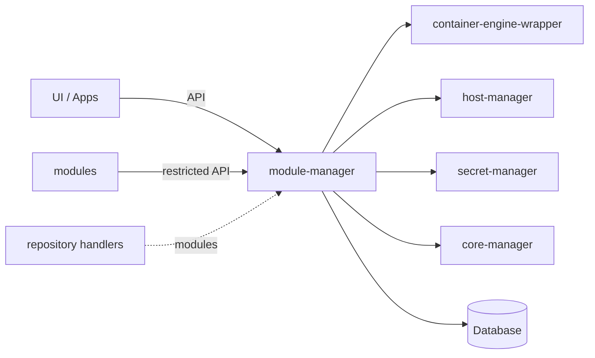

mgw-module-manager
=======

mgw-module-manager is the central service of the MGW ("multi gateway") edge-gateway stack.
It allows the installation of **modules** — containerized add-on applications.

State is kept in a MySQL database. `lib/` is a separate Go module containing the API
models and HTTP clients, so other services, apps and modules can interact with the service.

## Table of contents

- [Service interactions](#service-interactions)
- [Concepts](#concepts)
- [HTTP API](#http-api)
- [Architecture](#architecture)
- [Configuration](#configuration)

## Service interactions

| Service | Used for |
| --- | --- |
| [container-engine-wrapper](https://github.com/SENERGY-Platform/mgw-container-engine-wrapper) (CEW) | images, containers, volumes |
| [host-manager](https://github.com/SENERGY-Platform/mgw-host-manager) (HM) | host resources (applications, serial devices) |
| [secret-manager](https://github.com/SENERGY-Platform/mgw-secret-manager) (SM) | secret values and secret mounts |
| [core-manager](https://github.com/SENERGY-Platform/mgw-core-manager) (CM) | registering module HTTP endpoints with the gateway's reverse proxy |

## Concepts

### Repositories

Sources of modules, each with a source name, priority and one or more *channels*. Two backends
are implemented:

- **GitHub**: repositories containing modules fetched from GitHub; channels map to directories in the repositry. (E.g. https://github.com/SENERGY-Platform/mgw-module-repository)
- **host directory**: a local directory, source `localhost`, channel `default`, for side-loading
  and development.

### Modules

A Modfile declares everything a module needs: services (containers), auxiliary services,
dependencies on other modules, service references (env var injection
with templates), typed configs with user-input metadata, files and file groups, volumes, secrets,
host resources, ports and HTTP endpoints.

### Change requests

Installs, updates and removals go through a deliberate two-phase flow:

1. Create a change request — dependencies are resolved and module variants selected from the
   repositories.
2. Review the resulting install / change / remove plan, then execute it as a job, or cancel it.

Convenience endpoints exist for updating everything and for counting available updates.

### Deployment

Deploying a module takes user input (configs, global configs, secrets, host
resources, files) and then:

- generates a deployment id and container dns aliases,
- creates volumes,
- materializes config files and file groups on disk as bind mounts,
- mounts secrets via SM,
- creates the containers via CEW, injecting the container dns aliases of resolved dependencies,
- registers the module's HTTP endpoints with CM.
- ...

### Auxiliary deployments

Extra containers a *running* module can spawn, with their own labels,
configs and volumes. Images are restricted to the `auxImageSources` declared in the module's
Modfile.

### Advertisements

Key/value records a deployment publishes under a reference and other deployments or external apps can query — a
lightweight discovery mechanism.

### Global configs

Named, typed values shared by any number of deployments.

### Jobs

Every long-running operation (module change, deployment create / update / delete, repository
refresh, auxiliary deployment operations) runs asynchronously and returns a job. Job results are
cached and removed once they exceed the configured maximum age.

### Runtime monitors

Two handlers — one for deployments, one for auxiliary deployments — compare the desired
state in the database with the actual container state reported by CEW and start or
stop containers accordingly.

## HTTP API

| Set | Mounted at | Audience                                                                                                                          |
| --- | --- |-----------------------------------------------------------------------------------------------------------------------------------|
| standard | `/` | management surface for the UI and external apps: modules, repositories, deployments, global configs, change requests, job results |
| restricted | `/restricted` | calls coming from module containers: auxiliary deployments and advertisements                                                     |
| shared | both | read access to auxiliary deployments and advertisements, jobs, health, service info                                               |

Every response carries `X-Core-Id`, `X-Manager-Id`, `X-Runtime-Id`, `X-Version` and `X-Service`
headers; `X-Request-Id` is honoured or generated and threaded through the structured logs together
with the runtime and job ids.

## Configuration

### Service

| Env var | Type | Default | Description |
|---|---|---|---|
| `SERVER_PORT` | uint | `80` | HTTP port the API server listens on. |
| `MANAGER_ID_PATH` | string | `./service/mid` | File path where the manager's own ID is stored/read. |
| `CORE_ID` | string | – | ID of the MGW core this manager belongs to. |
| `MODULE_CONTAINER_NETWORK` | string | – | Container network that module containers are attached to. |
| `USE_UTC` | bool | `true` | Use UTC for timestamps. |
| `JOB_POLL_INTERVAL` | string | `500ms` | Interval for polling job state. |
| `IMAGE_NAME_ESCAPE_DEPTH` | int | `1` | Path-segment depth used when escaping image names. |
| `HOST_DEPLOYMENTS_PATH` | string | – | Path on the host to the deployments directory (for bind mounts). |
| `HOST_SECRETS_PATH` | string | – | Path on the host to the secrets directory (for bind mounts). |

### Logger

| Env var | Type | Default                                               | Description |
|---|---|-------------------------------------------------------|---|
| `HTTP_ACCESS_LOG` | bool | `false`                                               | Enable HTTP access logging. |
| `LOGGER_HANDLER` | string | `text`                                                | Log handler/format (`text`, `colored-text`, …). |
| `LOGGER_LEVEL` | string | `info`                                                | Log level. |
| `LOGGER_TIME_FORMAT` | string | `RFC3339Nano` (`2006-01-02T15:04:05.999999999Z07:00`) | Timestamp layout. |
| `LOGGER_TIME_UTC` | bool | `true`                                                | Emit log timestamps in UTC. |
| `LOGGER_FILE_PATH` | string | –                                                     | Write logs to this file instead of stdout. |
| `LOGGER_ADD_SOURCE` | bool | -                                                     | Include source file/line in records. |
| `LOGGER_ADD_META` | bool | -                                                     | Include metadata attributes in records. |
| `LOGGER_TRIM_FORMAT` | string | –                                                     | Trim spec (e.g. `20:[...]:10`), applied to the log message. |
| `LOGGER_TRIM_ATTRIBUTES` | string | –                                                     | Comma-separated attribute keys that should also be trimmed. |

### MGW core

| Env var | Type | Default | Description |
|---|---|---|---|
| `MGW_CEW_BASE_URL` | string | – | Base URL of the container engine wrapper. |
| `MGW_CM_BASE_URL` | string | – | Base URL of the core manager. |
| `MGW_HM_BASE_URL` | string | – | Base URL of the host manager. |
| `MGW_SM_BASE_URL` | string | – | Base URL of the secret manager. |
| `MGW_HTTP_TIMEOUT` | duration (string) | `30s` | HTTP timeout for calls to the core services. |

### Database

| Env var | Type | Default | Description                          |
|---|---|---|--------------------------------------|
| `DATABASE_ADDRESS` | string | – | Database host/address.               |
| `DATABASE_NAME` | string | `module_manager` | Database name.                       |
| `DATABASE_USER` | string | – | Database user.                       |
| `DATABASE_PASSWORD` | secret (string) | – | Database password.                   |
| `DATABASE_TIMEOUT` | duration (string) | `30s` | Query/connection timeout.            |
| `DATABASE_MAX_OPEN_CONNECTIONS` | int | `25` | Max open connections in the pool.    |
| `DATABASE_MAX_IDLE_CONNECTIONS` | int | `25` | Max idle connections in the pool.    |
| `DATABASE_CONNECTION_MAX_LIFETIME` | duration (string) | `5m` | Max lifetime of a pooled connection. |

### Modules handler

| Env var | Type | Default | Description |
|---|---|---|---|
| `MODULES_HANDLER_WORKDIR_PATH` | string | `./modules` | Working directory for module data. |

### Deployments handler

| Env var | Type | Default         | Description |
|---|---|-----------------|---|
| `DEPLOYMENTS_HANDLER_WORKDIR_PATH` | string | `./deployments` | Working directory for deployment data. |
| `DEPLOYMENTS_HANDLER_RUNTIME_MONITOR_STARTUP_DELAY` | duration (string) | -               | Delay before the runtime monitor starts. |
| `DEPLOYMENTS_HANDLER_RUNTIME_MONITOR_LOOP_DELAY` | duration (string) | `5s`            | Delay between runtime monitor iterations. |

### Aux deployments handler

| Env var | Type | Default | Description |
|---|---|---------|---|
| `AUX_DEPLOYMENTS_HANDLER_RUNTIME_MONITOR_STARTUP_DELAY` | duration (string) | -       | Delay before the aux runtime monitor starts. |
| `AUX_DEPLOYMENTS_HANDLER_RUNTIME_MONITOR_LOOP_DELAY` | duration (string) | `5s`    | Delay between aux runtime monitor iterations. |

### Host dir repository handler

| Env var | Type | Default | Description |
|---|---|---|---|
| `HOST_DIR_HANDLER_WORKDIR_PATH` | string | `./repositories/host_dir` | Working directory for the host-dir repository. |
| `HOST_DIR_HANDLER_PRIORITY` | int | `0` | Priority of this repository relative to others. |

### GitHub repositories handler

| Env var | Type              | Default | Description |
|---|-------------------|---|---|
| `GITHUB_HANDLER_BASE_URL` | string            | `https://api.github.com` | GitHub API base URL. |
| `GITHUB_HANDLER_WORKDIR_PATH` | string            | `./repositories/github` | Working directory for GitHub repository data. |
| `GITHUB_HANDLER_HTTP_TIMEOUT` | duration (string) | `1m` | HTTP timeout for GitHub API calls. |

### Jobs handler

| Env var | Type | Default | Description |
|---|---|---|---|
| `JOBS_HANDLER_MAX_JOB_AGE` | duration (string) | `24h` | Age after which finished jobs are removed. |
| `JOBS_HANDLER_CLEANUP_LOOP_DELAY` | duration (string) | `5m` | Delay between job cleanup runs. |
