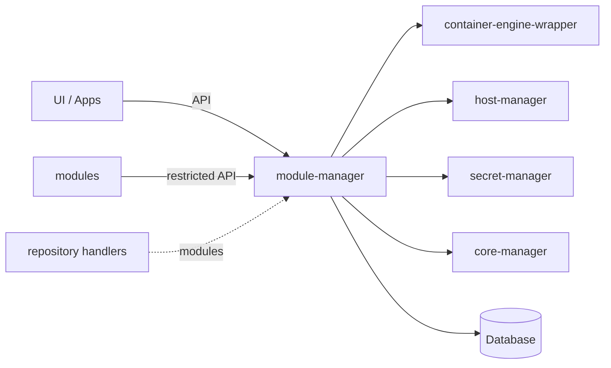
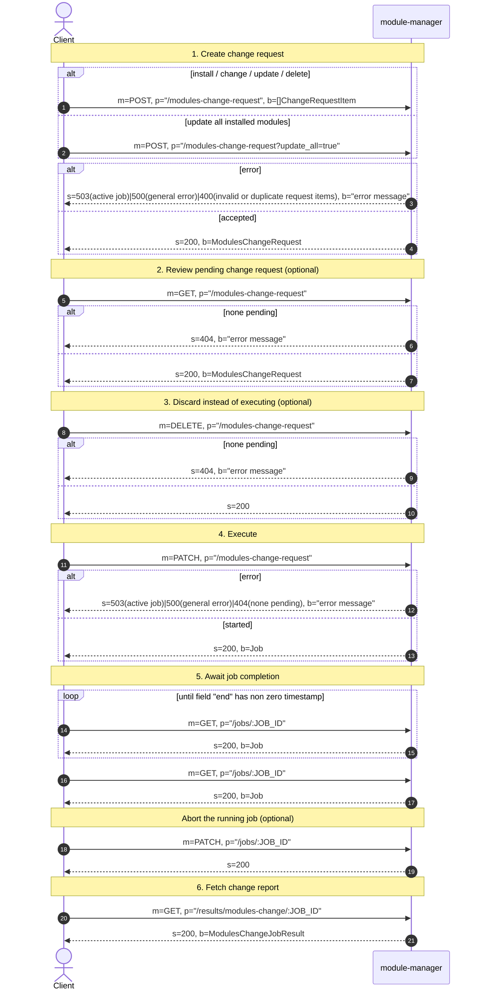
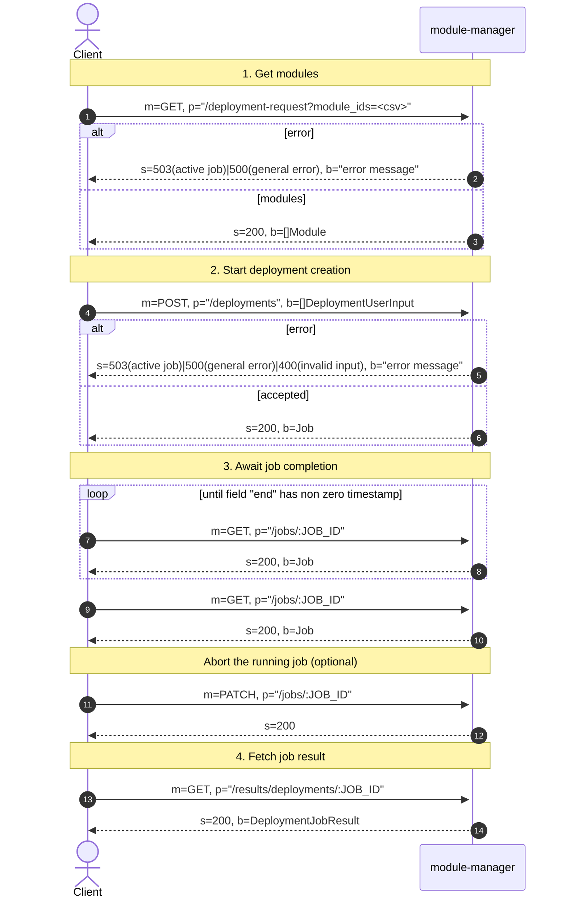
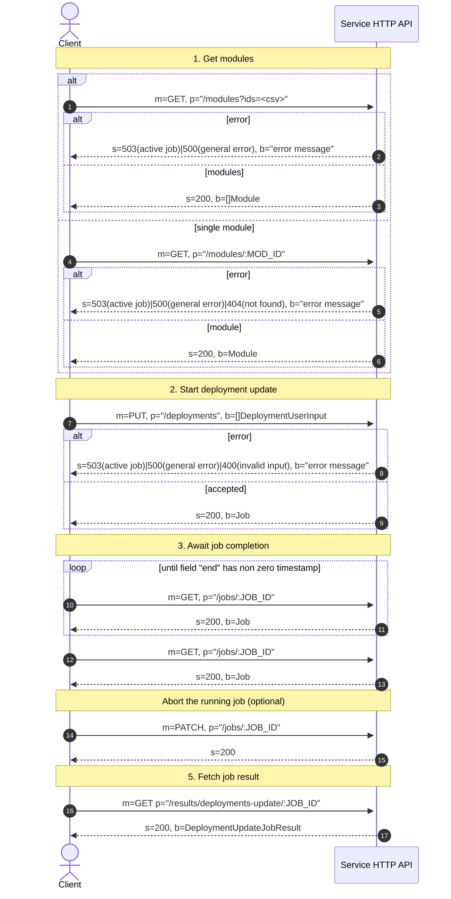

mgw-module-manager
=======

mgw-module-manager is the central service of the MGW ("multi gateway") edge-gateway stack.
It allows the installation of **modules** — containerized add-on applications.

State is kept in a MySQL database. `lib/` is a separate Go module containing the API
models and HTTP clients, so other services, apps and modules can interact with the service.

## Table of contents

- [Service interactions](#service-interactions)
- [Concepts](#concepts)
- [Configuration](#configuration)
- [HTTP API](#http-api)
- [Project structure](#project-structure)

## Service interactions

| Service | Used for |
| --- | --- |
| [container-engine-wrapper](https://github.com/SENERGY-Platform/mgw-container-engine-wrapper) (CEW) | images, containers, volumes |
| [host-manager](https://github.com/SENERGY-Platform/mgw-host-manager) (HM) | host resources (applications, serial devices) |
| [secret-manager](https://github.com/SENERGY-Platform/mgw-secret-manager) (SM) | secret values and secret mounts |
| [core-manager](https://github.com/SENERGY-Platform/mgw-core-manager) (CM) | registering module HTTP endpoints with the gateway's reverse proxy |



## Concepts

### Repositories

Sources of modules, each with a source name, priority and one or more *channels*. Two backends
are implemented:

- **GitHub**: repositories containing modules fetched from GitHub; channels map to directories in the repositry. (E.g. https://github.com/SENERGY-Platform/mgw-module-repository)
- **host directory**: a local directory, source `localhost`, channel `default`, for side-loading
  and development.

### Modules

A Modfile declares everything a module needs: services (containers), auxiliary services,
dependencies on other modules, service references (env var injection
with templates), typed configs with user-input metadata, files and file groups, volumes, secrets,
host resources, ports and HTTP endpoints.

### Change requests

Installs, updates and removals go through a deliberate two-phase flow:

1. Create a change request — dependencies are resolved and module variants selected from the
   repositories.
2. Review the resulting install / change / remove plan, then execute it as a job, or cancel it.

Convenience endpoints exist for updating everything and for counting available updates.

### Deployment

Deploying a module takes user input (configs, global configs, secrets, host
resources, files) and then:

- generates a deployment id and container dns aliases,
- creates volumes,
- materializes config files and file groups on disk as bind mounts,
- mounts secrets via SM,
- creates the containers via CEW, injecting the container dns aliases of resolved dependencies,
- registers the module's HTTP endpoints with CM.
- ...

### Auxiliary deployments

Extra containers a *running* module can spawn, with their own labels,
configs and volumes. Images are restricted to the `auxImageSources` declared in the module's
Modfile.

### Advertisements

Key/value records a deployment publishes under a reference and other deployments or external apps can query — a
lightweight discovery mechanism.

### Global configs

Named, typed values shared by any number of deployments.

### Jobs

Every long-running operation (module change, deployment create / update / delete, repository
refresh, auxiliary deployment operations) runs asynchronously and returns a job. Job results are
cached and removed once they exceed the configured maximum age.

### Runtime monitors

Two handlers — one for deployments, one for auxiliary deployments — compare the desired
state in the database with the actual container state reported by CEW and start or
stop containers accordingly.

## Configuration

### Service

| Env var | Type | Default | Description |
|---|---|---|---|
| `SERVER_PORT` | uint | `80` | HTTP port the API server listens on. |
| `MANAGER_ID_PATH` | string | `./service/mid` | File path where the manager's own ID is stored/read. |
| `CORE_ID` | string | – | ID of the MGW core this manager belongs to. |
| `MODULE_CONTAINER_NETWORK` | string | – | Container network that module containers are attached to. |
| `USE_UTC` | bool | `true` | Use UTC for timestamps. |
| `JOB_POLL_INTERVAL` | string | `500ms` | Interval for polling job state. |
| `IMAGE_NAME_ESCAPE_DEPTH` | int | `1` | Path-segment depth used when escaping image names. |
| `HOST_DEPLOYMENTS_PATH` | string | – | Path on the host to the deployments directory (for bind mounts). |
| `HOST_SECRETS_PATH` | string | – | Path on the host to the secrets directory (for bind mounts). |

### Logger

| Env var | Type | Default                                               | Description |
|---|---|-------------------------------------------------------|---|
| `HTTP_ACCESS_LOG` | bool | `false`                                               | Enable HTTP access logging. |
| `LOGGER_HANDLER` | string | `text`                                                | Log handler/format (`text`, `colored-text`, …). |
| `LOGGER_LEVEL` | string | `info`                                                | Log level. |
| `LOGGER_TIME_FORMAT` | string | `RFC3339Nano` (`2006-01-02T15:04:05.999999999Z07:00`) | Timestamp layout. |
| `LOGGER_TIME_UTC` | bool | `true`                                                | Emit log timestamps in UTC. |
| `LOGGER_FILE_PATH` | string | –                                                     | Write logs to this file instead of stdout. |
| `LOGGER_ADD_SOURCE` | bool | -                                                     | Include source file/line in records. |
| `LOGGER_ADD_META` | bool | -                                                     | Include metadata attributes in records. |
| `LOGGER_TRIM_FORMAT` | string | –                                                     | Trim spec (e.g. `20:[...]:10`), applied to the log message. |
| `LOGGER_TRIM_ATTRIBUTES` | string | –                                                     | Comma-separated attribute keys that should also be trimmed. |

### MGW core

| Env var | Type | Default | Description |
|---|---|---|---|
| `MGW_CEW_BASE_URL` | string | – | Base URL of the container engine wrapper. |
| `MGW_CM_BASE_URL` | string | – | Base URL of the core manager. |
| `MGW_HM_BASE_URL` | string | – | Base URL of the host manager. |
| `MGW_SM_BASE_URL` | string | – | Base URL of the secret manager. |
| `MGW_HTTP_TIMEOUT` | duration (string) | `30s` | HTTP timeout for calls to the core services. |

### Database

| Env var | Type | Default | Description                          |
|---|---|---|--------------------------------------|
| `DATABASE_ADDRESS` | string | – | Database host/address.               |
| `DATABASE_NAME` | string | `module_manager` | Database name.                       |
| `DATABASE_USER` | string | – | Database user.                       |
| `DATABASE_PASSWORD` | secret (string) | – | Database password.                   |
| `DATABASE_TIMEOUT` | duration (string) | `30s` | Query/connection timeout.            |
| `DATABASE_MAX_OPEN_CONNECTIONS` | int | `25` | Max open connections in the pool.    |
| `DATABASE_MAX_IDLE_CONNECTIONS` | int | `25` | Max idle connections in the pool.    |
| `DATABASE_CONNECTION_MAX_LIFETIME` | duration (string) | `5m` | Max lifetime of a pooled connection. |

### Modules handler

| Env var | Type | Default | Description |
|---|---|---|---|
| `MODULES_HANDLER_WORKDIR_PATH` | string | `./modules` | Working directory for module data. |

### Deployments handler

| Env var | Type | Default         | Description |
|---|---|-----------------|---|
| `DEPLOYMENTS_HANDLER_WORKDIR_PATH` | string | `./deployments` | Working directory for deployment data. |
| `DEPLOYMENTS_HANDLER_RUNTIME_MONITOR_STARTUP_DELAY` | duration (string) | -               | Delay before the runtime monitor starts. |
| `DEPLOYMENTS_HANDLER_RUNTIME_MONITOR_LOOP_DELAY` | duration (string) | `5s`            | Delay between runtime monitor iterations. |

### Aux deployments handler

| Env var | Type | Default | Description |
|---|---|---------|---|
| `AUX_DEPLOYMENTS_HANDLER_RUNTIME_MONITOR_STARTUP_DELAY` | duration (string) | -       | Delay before the aux runtime monitor starts. |
| `AUX_DEPLOYMENTS_HANDLER_RUNTIME_MONITOR_LOOP_DELAY` | duration (string) | `5s`    | Delay between aux runtime monitor iterations. |

### Host dir repository handler

| Env var | Type | Default | Description |
|---|---|---|---|
| `HOST_DIR_HANDLER_WORKDIR_PATH` | string | `./repositories/host_dir` | Working directory for the host-dir repository. |
| `HOST_DIR_HANDLER_PRIORITY` | int | `0` | Priority of this repository relative to others. |

### GitHub repositories handler

| Env var | Type              | Default | Description |
|---|-------------------|---|---|
| `GITHUB_HANDLER_BASE_URL` | string            | `https://api.github.com` | GitHub API base URL. |
| `GITHUB_HANDLER_WORKDIR_PATH` | string            | `./repositories/github` | Working directory for GitHub repository data. |
| `GITHUB_HANDLER_HTTP_TIMEOUT` | duration (string) | `1m` | HTTP timeout for GitHub API calls. |

### Jobs handler

| Env var | Type | Default | Description |
|---|---|---|---|
| `JOBS_HANDLER_MAX_JOB_AGE` | duration (string) | `24h` | Age after which finished jobs are removed. |
| `JOBS_HANDLER_CLEANUP_LOOP_DELAY` | duration (string) | `5m` | Delay between job cleanup runs. |

## HTTP API

| Set | Mounted at | Audience                                                                                                                          |
| --- | --- |-----------------------------------------------------------------------------------------------------------------------------------|
| standard | `/` | management surface for the UI and external apps: modules, repositories, deployments, global configs, change requests, job results |
| restricted | `/restricted` | calls coming from module containers: auxiliary deployments and advertisements                                                     |
| shared | both | read access to auxiliary deployments and advertisements, jobs, health, service info                                               |

Every response carries `X-Core-Id`, `X-Manager-Id`, `X-Runtime-Id`, `X-Version` and `X-Service`
headers; `X-Request-Id` is honoured or generated and threaded through the structured logs together
with the runtime and job ids.

### Creating and Executing a Modules Change Request

HTTP interaction between a client and the service API. The pending change request is a singleton on the
service: `POST` creates or replaces it, `PATCH` executes and clears it, `DELETE` discards it.

The request type is determined by the `ChangeRequestItem` fields in the `POST` body:

| Intent       | Request item                                  | Preview list populated |
|--------------|-----------------------------------------------|------------------------|
| install/change | `{"id": ..., "source": ..., "channel": ...}`  | `install`/`change`             |
| update       | `{"id": ..., "update": true}`                 | `change`               |
| delete       | `{"id": ..., "remove": true}`                 | `remove`               |



Per-module failures are reported in `failed` — the job itself still completes successfully. A module is
only removed while it is not deployed, so its deployment must be deleted before a `remove` item can succeed.

#### The `ChangeRequestItem`

The body of `POST /modules-change-request` is a JSON array of `ChangeRequestItem`. One item describes the
intent for exactly one module; the service turns the whole array into a single change request preview.

```json
{
  "id": "github.com/acme/mod-a",
  "source": "github.com/acme/repository",
  "channel": "main",
  "remove": false,
  "update": false
}
```

| Field | Type | Meaning |
|-------|------|---------|
| `id` | string | Module ID the item refers to. Used to look the module up in the repositories (install) or among the installed modules (update, remove). |
| `source` | string | Repository source the module is taken from. Only evaluated when neither `update` nor `remove` is set. |
| `channel` | string | Repository channel the module is taken from. Only evaluated when neither `update` nor `remove` is set. |
| `remove` | bool | Uninstall the module. `source` and `channel` are ignored. |
| `update` | bool | Update the module in place. `source` and `channel` are taken from the installed module and any values sent are ignored. |

`remove` and `update` are the two mode flags; leaving both unset selects the third mode, install/change, which is the only mode that reads `source` and `channel`.

#### How an item is processed

1. **Validation**: rejects illegal combinations and conflicting duplicates.
   The whole request fails; nothing is stored.
2. **Repository selection**: `remove` items are skipped entirely. Dependencies of
   every selected module are resolved and added to the request automatically, first from the
   highest-priority repository and channel, then from the origin repository and channel of the
   selecting module.
3. **Classification for preview**: each selected module becomes an `install` entry (not
   installed yet), a `change` entry (installed, but with a different source, channel or version), or is
   dropped (installed with the identical variant and version). `remove` entries are kept only if the module
   is actually installed and is not also selected for install or change.

An item can therefore be silently dropped — the preview is the authoritative answer to
what will actually happen. If all items are dropped, the response contains three empty lists and no
change request is stored.

### Create Deployment

HTTP interaction between a client and the service HTTP API when creating a deployment.



### Update Deployment

HTTP interaction between a client and the service HTTP API when updating a deployment.



## Project structure

Folder-level map of the repository. Files are listed for the root level only; every
other level is documented by folder. The `bin/` folder (runtime working directory
created by the service: module data, deployment data, repository caches, backups) and
`.dockerignore` are excluded on purpose.

### Root level

```
.
├── .github/            CI definitions
├── lib/                public Go module: API models + HTTP clients for consumers
├── pkg/                the service implementation
├── test_client/        manual/integration client used to exercise a running service
├── Dockerfile          two-stage build (golang builder → alpine), healthcheck on /health/service
├── main.go             process entrypoint: config, logger, clients, handlers, wiring, goroutines
└── ...
```

`main.go` is the composition root. It loads the configuration, builds the structured
logger and injects it into every package logger, creates the MySQL connection pool and
the database handler, constructs the repository / module / deployment / aux-deployment /
global-config / advertisement / job handlers, assembles them into the `service.Service`,
runs the database migrations, initializes the repository handlers, creates the HTTP API
handler and server, and finally starts the long-running goroutines (deployment runtime
monitor, aux-deployment runtime monitor, job cleanup, HTTP server, signal-triggered
shutdown).

### lib/ — public API module

Separate Go module (`…/mgw-module-manager/lib`) so other MGW services, apps and modules
can depend on the API surface without pulling in the service implementation.

| Folder | Purpose |
| --- | --- |
| `lib/models` | Wire/DTO types of the whole API: modules and change requests, deployments and user input, auxiliary deployments and their volumes, deployment advertisements, global configs, jobs and typed job results, health info, repositories and module variants, error results. Also aliases types re-exported from `mgw-module-lib`. |
| `lib/clients` | HTTP clients for the API surface a module container talks to: auxiliary deployments, deployment advertisements and deployments health, plus the shared request/response plumbing (JSON decoding, error wrapping with status code and body, URL path escaping, query building) and the interfaces those clients satisfy. |
| `lib/constants` | Shared constants: HTTP paths, query and header names, container state/health aliases, deployment state values. |
| `lib/errors` | Generic error base with typed wrappers (`ErrNotFound`, `ErrExists`, `ErrActiveJob`, `ErrInvalidInput`) used across service, API and clients for status-code mapping. |

### pkg/api/ — HTTP layer

Gin-based API. `CreateHandler` builds the middleware chain (optional structured access
log, runtime-id and request-id context values, static `X-Core-Id`/`X-Manager-Id`/
`X-Runtime-Id`/`X-Version`/`X-Service` headers, error handler, panic recovery) and
registers three handler sets: standard handlers at `/`, restricted handlers at
`/restricted`, and shared handlers on both. Errors are mapped from the typed `lib/errors`
values to HTTP status codes in one place.

| Folder | Purpose |
| --- | --- |
| `pkg/api/handlers` | One file per resource group, each function returning method, path and gin handler: modules and change requests, repositories, deployments, auxiliary deployments, deployment advertisements, global configs, jobs, job results, health, service info, swagger endpoints. Also holds all query/filter parsing and validation. |
| `pkg/api/swagger-docs` | Generated OpenAPI documentation (`docs.go`, `swagger.json`, `swagger.yaml`) served by the swagger handlers; the version field is filled in at startup. |

### pkg/components/handler/ — domain handlers

| Folder | Purpose |
| --- | --- |
| `pkg/components/handler/modules` | Installed-module inventory: add, update and delete modules from a repository file system (Modfile parsing, image pulls via CEW, work directory management), read modules with resolved dependencies, in-memory module cache. |
| `pkg/components/handler/repositories` | Aggregates all repository backends behind one interface: builds and refreshes the module lookup map across sources/channels with priority handling, lists repositories and repository modules, resolves a module id + source + channel to a file system, and delegates repository creation/deletion to the matching backend. |
| `pkg/components/handler/repositories/github` | GitHub backend: source/channel definitions persisted as files in its work directory, last-commit polling, tar.gz archive download and extraction per validated commit, exposing each channel's modules as `fs.FS`. |
| `pkg/components/handler/repositories/host_dir` | Local-directory backend (source `localhost`, channel `default`) for side-loading and module development. |
| `pkg/components/handler/deployments` | The core of the service: create, update, recreate, delete, enable and disable deployments. Covers config resolution (defaults, user input, global configs), file and file-group materialization on disk, volumes, secret mounts via the secret manager, host resources via the host manager, container creation via CEW with dependency/config/secret env injection and bind/tmpfs/volume/application/secret mounts, HTTP endpoint registration with the core manager, image pulls, listing with runtime state, and the runtime monitor reconciling desired vs. actual container state. |
| `pkg/components/handler/aux_deployments` | Same lifecycle for auxiliary deployments a running module spawns: create/update/recreate/delete, enable/disable, labels, configs merged with the parent deployment's, volumes with mounts, image validation against the module's `auxImageSources`, container creation and its own runtime monitor. |
| `pkg/components/handler/dep_advertisements` | Key/value records a deployment publishes under a reference: read, query, put (single and batch) and delete, with deployment/module ownership enforcement. |
| `pkg/components/handler/global_configs` | CRUD for named, typed values shared by any number of deployments. |
| `pkg/components/handler/jobs` | Asynchronous job registry: plain and slot-based jobs (slots serialize conflicting long-running operations), per-job cancellable context, lookup and filtering, and a cleanup loop that drops finished jobs past the maximum age and triggers job-result cleanup. |
| `pkg/components/handler/database` | MySQL persistence layer. Connector and pool setup, migration runner, and per-domain SQL: modules, deployments (containers, volumes, host resources, secrets, user/global configs, files and file groups), auxiliary deployments (labels, configs, volumes, volume mounts, parent relations), deployment advertisements and global configs, including the typed config-value column handling and filter generation. |
| `pkg/components/handler/database/migrations/db_init` | Initial schema: embedded `.sql` files per domain (modules, deployments, aux deployments, advertisements, global configs) executed statement by statement. |
| `pkg/components/handler/database/migrations/restructure` | One-off restructuring migration of the legacy schema, table by table (modules, deployments, containers, host resources, secrets, configs incl. list configs, aux deployments/containers/labels/volumes/configs, advertisements and their items) plus schema-introspection helpers. |

### pkg/components/helper/ — technical helpers

| Folder | Purpose |
| --- | --- |
| `pkg/components/helper/archive` | tar.gz extraction into a target path. |
| `pkg/components/helper/configs` | Typed config values: conversion to/from `any`, string and list rendering, data-type mapping, equality and validation against a Modfile config definition. |
| `pkg/components/helper/containers` | CEW convenience wrappers: stop, remove, ensure image present, remove volume. |
| `pkg/components/helper/errors` | Multi-error joining with optional prefix/format, preserving `errors.Unwrap` semantics. |
| `pkg/components/helper/file_sys` | Copy a file or a whole `fs.FS` to disk, find a file by predicate. |
| `pkg/components/helper/http` | Pre-configured `http.Client` factory with timeout. |
| `pkg/components/helper/job` | Await a job on a remote MGW service by polling its job endpoint. |
| `pkg/components/helper/maps` | Collect an iterator into a map by key function. |
| `pkg/components/helper/modfile` | Locate and parse `Modfile.yml`/`Modfile.yaml` in a module file system into a module-lib module. |
| `pkg/components/helper/mutex_map` | Keyed read/write mutexes, used to serialize operations per deployment. |
| `pkg/components/helper/naming` | Identity and naming: runtime id, manager id (persisted to disk), core id, container network, container names and dns aliases, volume names, hashes. |
| `pkg/components/helper/os_signal` | Context-aware OS signal waiting for graceful shutdown. |
| `pkg/components/helper/slices` | Slice/iterator utilities: key extraction, pair extraction, mapping, `[]any` conversion, deduplication. |
| `pkg/components/helper/slog` | Structured logger construction and extraction of context attributes (runtime id, request id, job id) into log records. |
| `pkg/components/helper/sql_db` | `*sql.DB` construction with pool limits from configuration. |
| `pkg/components/helper/time` | UTC-aware `Now()`. |
| `pkg/components/helper/url` | URL path escaping to a configurable segment depth. |
| `pkg/components/helper/uuid` | UUID generation. |

### pkg/service/ — use-case layer

Single `Service` struct holding all handlers plus the service-info handler; the API layer
talks only to this. Per-resource files implement the use cases: module change requests
(validation, repository selection with dependency resolution, install/change/remove
classification, execution as a job), repository listing and refresh, deployment create /
update / recreate / delete / enable / disable, auxiliary deployment operations, global
configs, advertisements, deployments health aggregation, job listing and cancellation,
and the in-memory store of typed job results (cleaned up by the jobs handler callback).

### pkg/configuration/ and pkg/models/

| Folder | Purpose |
| --- | --- |
| `pkg/configuration` | Configuration struct with defaults, env-var/file loading with custom type parsers, command-line flags (config path, manager id) and base64-JSON dumping of the effective configuration for debug logs. |
| `pkg/models` | Internal domain models used between service, handlers and database — deployments and their resources, auxiliary deployments, modules (incl. the database representation), repository modules, typed config values and filters. Distinct from `lib/models`, which is the public wire format. |

### test_client/

Standalone client package driving a running service over HTTP, used for manual and
integration testing rather than unit testing. It wraps the standard API (modules and
change requests, repositories, deployments, global configs, jobs incl. awaiting
completion, job results) and reuses `lib/clients` for the restricted/shared surface
(auxiliary deployments, advertisements). Configured by a local `config.json` holding base
URL, session cookie and URL escape depth — it contains personal session credentials and
is not meant to be shared.
