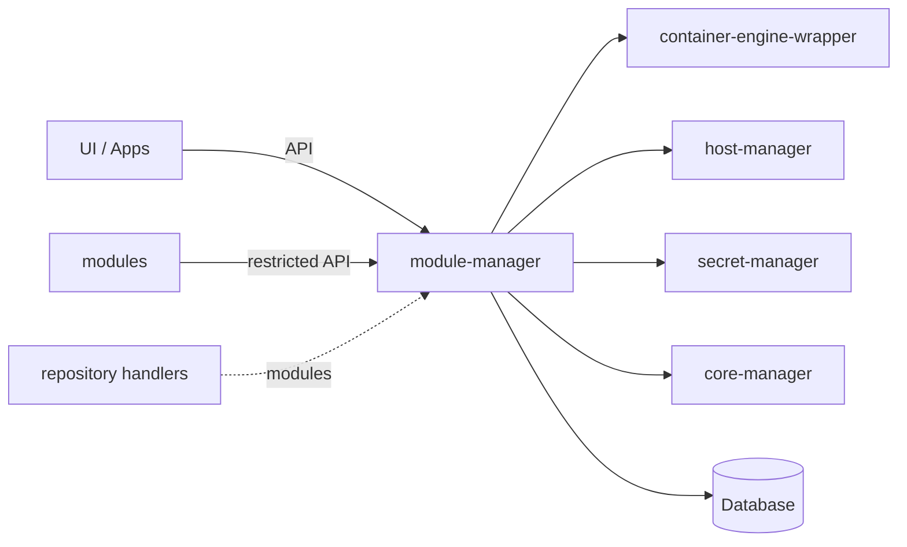

mgw-module-manager
=======

mgw-module-manager is the central service of the MGW ("multi gateway") edge-gateway stack.
It allows the installation of **modules** — containerized add-on applications.

State is kept in a MySQL database. `lib/` is a separate Go module containing the API
models and HTTP clients, so other services — and modules can interact with the service.

## Table of contents

- [Service interactions](#service-interactions)
- [Concepts](#concepts)
- [HTTP API](#http-api)
- [Architecture](#architecture)
- [Configuration](#configuration)

## Service interactions

| Service | Used for |
| --- | --- |
| [container-engine-wrapper](https://github.com/SENERGY-Platform/mgw-container-engine-wrapper) (CEW) | images, containers, volumes |
| [host-manager](https://github.com/SENERGY-Platform/mgw-host-manager) (HM) | host resources (applications, serial devices) |
| [secret-manager](https://github.com/SENERGY-Platform/mgw-secret-manager) (SM) | secret values and secret mounts |
| [core-manager](https://github.com/SENERGY-Platform/mgw-core-manager) (CM) | registering module HTTP endpoints with the gateway's reverse proxy |

## Concepts

### Repositories

Sources of modules, each with a source name, priority and one or more *channels*. Two backends
are implemented:

- **GitHub**: repositories containing modules fetched from GitHub; channels map to directories in the repositry. (E.g. https://github.com/SENERGY-Platform/mgw-module-repository)
- **host directory**: a local directory, source `localhost`, channel `default`, for side-loading
  and development.

### Modules

A Modfile declares everything a module needs: services (containers), auxiliary services,
dependencies on other modules, service references (env var injection
with templates), typed configs with user-input metadata, files and file groups, volumes, secrets,
host resources, ports and HTTP endpoints.

### Change requests

Installs, updates and removals go through a deliberate two-phase flow:

1. Create a change request — dependencies are resolved and module variants selected from the
   repositories.
2. Review the resulting install / change / remove plan, then execute it as a job, or cancel it.

Convenience endpoints exist for updating everything and for counting available updates.

### Deployment

Deploying a module takes user input (configs, global configs, secrets, host
resources, files) and then:

- generates a deployment id and container dns aliases,
- creates volumes,
- materializes config files and file groups on disk as bind mounts,
- mounts secrets via SM,
- creates the containers via CEW, injecting the container dns aliases of resolved dependencies,
- registers the module's HTTP endpoints with CM.
- ...

### Auxiliary deployments

Extra containers a *running* module can spawn, with their own labels,
configs and volumes. Images are restricted to the `auxImageSources` declared in the module's
Modfile.

### Advertisements

Key/value records a deployment publishes under a reference and other deployments or external apps can query — a
lightweight discovery mechanism.

### Global configs

Named, typed values shared by any number of deployments.

### Jobs

Every long-running operation (module change, deployment create / update / delete, repository
refresh, auxiliary deployment operations) runs asynchronously and returns a job. Job results are
cached and removed once they exceed the configured maximum age.

### Runtime monitors

Two handlers — one for deployments, one for auxiliary deployments — compare the desired
state in the database with the actual container state reported by CEW and start or
stop containers accordingly.

## HTTP API

| Set | Mounted at | Audience                                                                                                                          |
| --- | --- |-----------------------------------------------------------------------------------------------------------------------------------|
| standard | `/` | management surface for the UI and external apps: modules, repositories, deployments, global configs, change requests, job results |
| restricted | `/restricted` | calls coming from module containers: auxiliary deployments and advertisements                                                     |
| shared | both | read access to auxiliary deployments and advertisements, jobs, health, service info                                               |

Every response carries `X-Core-Id`, `X-Manager-Id`, `X-Runtime-Id`, `X-Version` and `X-Service`
headers; `X-Request-Id` is honoured or generated and threaded through the structured logs together
with the runtime and job ids.

## Configuration

